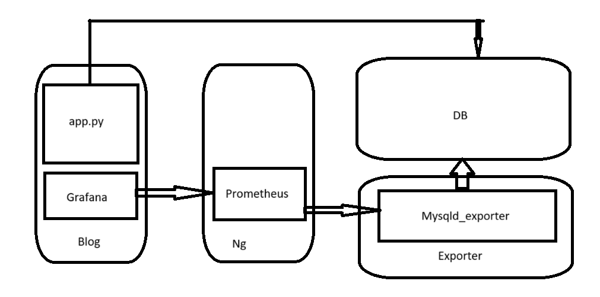
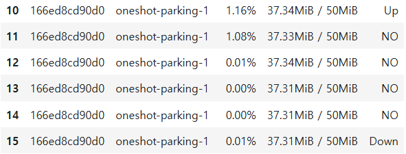

# Encore PlayData DE32 5th team
# docker_up

## Intrduce

본 레포지토리는 PlayData Encore - DataEngineering 32기 5조의 5번째 프로젝트로 최종 프로젝트 대비 구조설계를 진행한 프로젝트입니다.



## Installation

``` bash
$ git clone https://github.com/DE-32-5-Team5/docker_up.git
$ cd docker_up
$ git checkout 0.4/release
$ pdm venv create
$ source .venv/bin/activate
$ pip install .
```

## Usage

### Start
```
$ oneshot -i
Initialize env setting...
Enter Database root password : <your root password>
Enter User Name : <your user name>
Enter user Password : <your user password>
env install complete.
[+] Running 9/9
 ✔ Network oneshot_monitoring      Created                                                                                                                           0.3s
 ✔ Network oneshot_default         Created                                                                                                                           0.2s
 ✔ Container mariadb_container     Started                                                                                                                           1.1s
 ✔ Container oneshot-parking-1     Started                                                                                                                           2.9s
 ✔ Container oneshot-controller-1  Started                                                                                                                           1.6s
 ✔ Container grafana_container     Started                                                                                                                           1.6s
 ✔ Container exporter_container    Started                                                                                                                           1.6s
 ✔ Container nginx_container       Started                                                                                                                           3.3s
 ✔ Container oneshot-agent-1       Started  
```

### Finish
``` bash
$ oneshot -d
[+] Running 6/6
 ✔ Container exporter_container  Removed                                                                                                                             1.2s
 ✔ Container grafana_container   Removed                                                                                                                             1.5s
 ✔ Container nginx_container     Removed                                                                                                                             1.6s
 ✔ Container mariadb_container   Removed                                                                                                                             1.1s
 ✔ Container oneshot-parking-1   Removed                                                                                                                             1.8s
 ✔ Network oneshot_monitoring    Removed                                                                                                                             0.8s
```

### Remove
``` bash
$ oneshot -r
[+] Running 9/9
 ✔ Container oneshot-agent-1       Removed                                                                                                                          10.5s
 ✔ Container exporter_container    Removed                                                                                                                           0.9s
 ✔ Container grafana_container     Removed                                                                                                                           1.2s
 ✔ Container nginx_container       Removed                                                                                                                           1.6s
 ✔ Container mariadb_container     Removed                                                                                                                           1.0s
 ✔ Container oneshot-parking-1     Removed                                                                                                                           3.0s
 ✔ Container oneshot-controller-1  Removed                                                                                                                          13.0s
 ✔ Network oneshot_default         Removed                                                                                                                           0.7s
 ✔ Network oneshot_monitoring      Removed                                                                                                                           1.4s
Untagged: oneshot-db:latest
Deleted: sha256:cb4fa31346fbaa0cae384a55a588682e8ee4e4c908d1cb874f1efadbe2ac13f8
Untagged: oneshot-exporter:latest
Deleted: sha256:c08a3dc0599b9502a03bee4f5354e5ac2a1224b3bf86c99330dc6bc7ab4ce72b
Untagged: oneshot-parking:latest
Deleted: sha256:0defcea0be00c072c7a7b93c5e3c5102fede28d222543809743652dd9d539091
Untagged: oneshot-ng:latest
Deleted: sha256:1696073b26d4333b50b002b3c7ce802ee03dbe49f696a3aea81d3f3726d02d4a
```

### AutoScale

``` python
$ python auto_scale.py
```

본 스크립트는 Docker Compose를 사용하여 docker-compose.yml 파일에 정의된 서비스 중 parking 서비스의 CPU 사용률을 모니터링하고, 설정된 임계값을 초과할 경우 자동으로 스케일 아웃 및 스케일 인을 수행합니다. 또한, CPU 및 메모리 사용량 정보를 CSV 파일로 저장합니다.
    - 스케일 아웃 (Scale out) : 사용률이 임계값을 1분 이상 초과하면 컨테이너 개수를 1 증가시킵니다.
    - 스케일 인   (Scale in ) : CPU 사용률이 임계값 이하로 1분 이상 지속되고, 컨테이너가 2개 이상일 경우 개수를 1 감소시킵니다.
    - 10초에 한 번씩 docker stats 결과를 CSV 파일에 저장합니다.


### Streamlit
**CPU 사용량 조회**


**Manual Scale**


**Graph**


**Prometheus Client Real Time CPU Usage**


